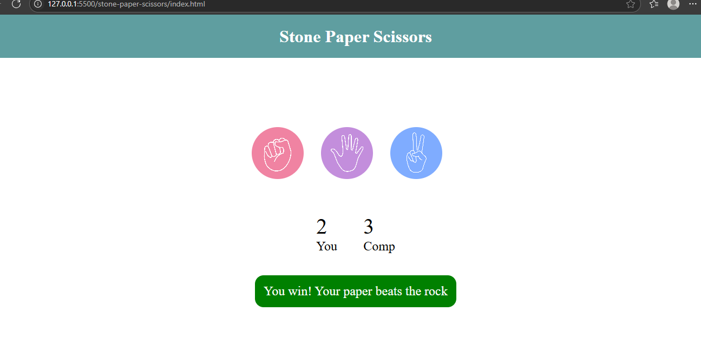

# Stone Paper Scissors Game

A simple and interactive **Stone Paper Scissors** (Rock Paper Scissors) game built using **HTML, CSS, and JavaScript**. This beginner-level project demonstrates the use of **DOM manipulation**, **event handling**, and **basic game logic** in JavaScript.

## Features

- Play against the computer
- Computer makes random choices
- Visual feedback for winner/loser/tie
- Restart and play multiple rounds

## Screenshot

## Tech Stack

- HTML  
- CSS 
- JavaScript

## How It Works

1. User clicks on one of the three options: stone, paper, or scissors.
2. Computer randomly selects one of the three.
3. The result (win/lose/draw) is displayed.
4. Score updates accordingly.

## Live Demo

[View Project Live](https://momina45.github.io/stone-paper-scissors/)

